# Beender

## Introduction

Beender is an application designed to help users plan their next trip from start to finish. The application works similarly to "Tinder" in that it presents cards of sites, selected according to the user’s preferences, and the user can swipe right if he wants to visit that site, or swipe left if he doesn't. The sites are drawn using Google API. Additionally, when the user presses a card, another screen appears with more information about that site such as additional photos, ratings, and reviews. Once the user has selected sites for their trip, they can go to the map screen and see all the sites they have chosen and a recommended route. The user can see all his past trips in the archive screen.

## User Manual

### Login & Register

First register a new account using a full name, email, and password.
Notes: Email is required to be in a proper format (example@mail.com), and the password has to be at least 6 characters long.

  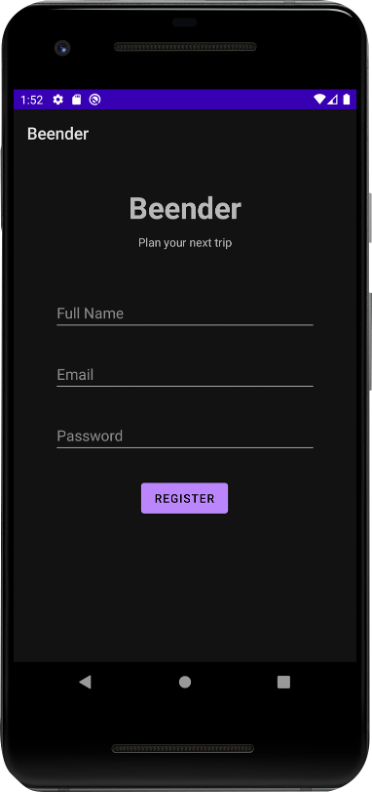
  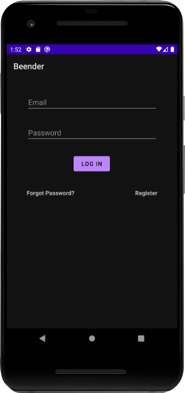

After registration, you’ll automatically be logged in and directed to the main Dashboard.

### Preferences

Before you start using the app, first head over the preferences screen by pressing the cog icon in the bottom menu.

  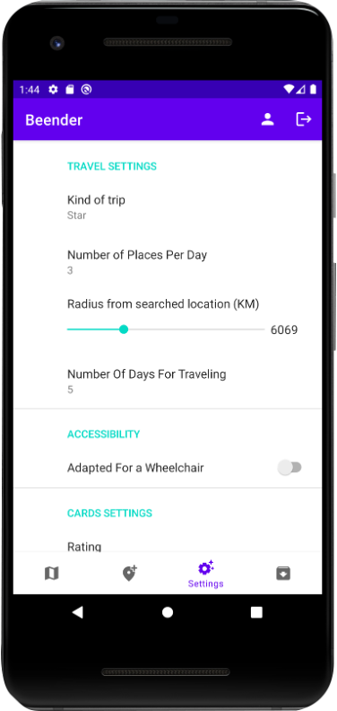

On this screen you can set your preferences how you like.
Make sure to choose between a “Journey” or “Star” type trip, as it changes how you plan your trip.

Journey: A journey trip is a simple A -> B type of a route. You select an initial destination, and go through waypoints until you end in your last destination. This type of a trip is suited for users that plan to be on the move and visit many different places throughout the trip.

Star: A star trip starts at a hotel, and branches out to different routes that are separated by days. Each day you’ll visit a few destinations and return to the hotel to end the day. This type of a trip is suited for users who plan to stay around the same area and get to experience a specific place, like a city.

For a star type trip, you need to input the length of your trip in days in the preferences screen.

### Dashboard

This is the main screen where you’ll plan out your trip.
First, click on the search bar above, and type in the place you wish to travel to.

Note: For the best results, you should type in the name of a city, not a country.

  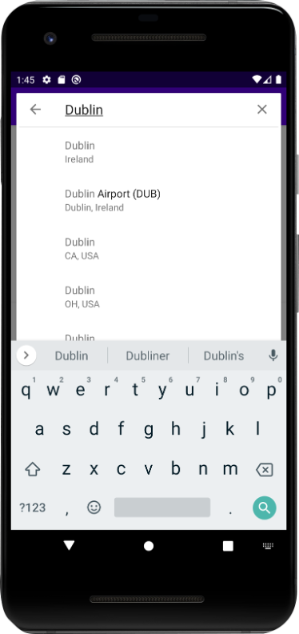
  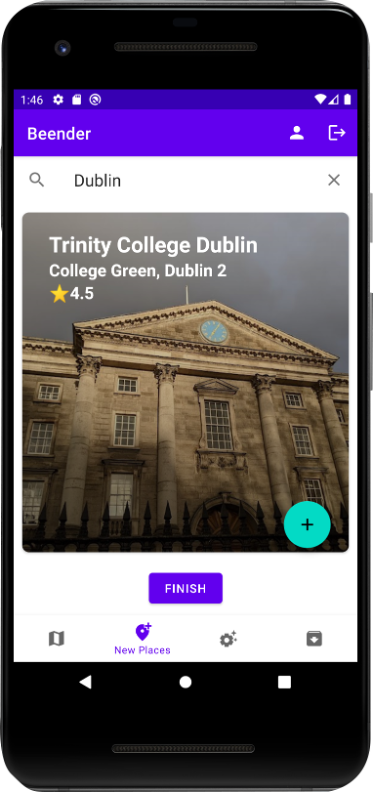

After typing in the place name, select one of the suggestions given by Google.
Our app will instantly present you with cards of destinations you could choose from.

### How to use the cards

Each card presents a unique destination, along with its name and rating.
To know more about each destination, simply click on the card and you’ll be directed to the Details screen.

If you like a certain card and you want to add it to your trip, swipe right and it will automatically be displayed on the Map screen. If you don’t like a card, swipe it to the left.

  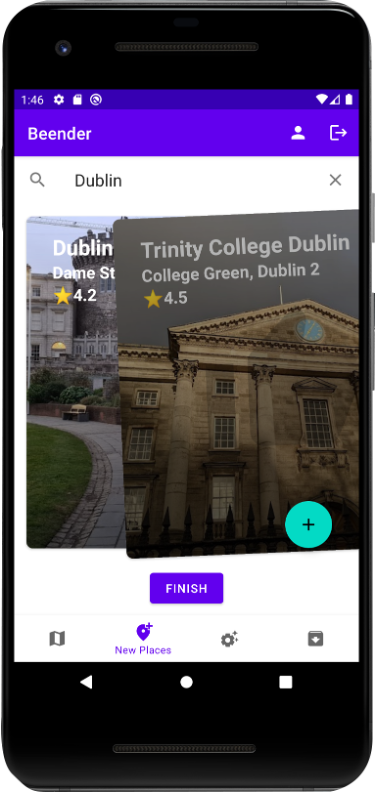
  
Journey vs Star
In a journey type trip, you have a “Finish” button below the cards. Clicking on it will end your trip planning process and direct you to the Map screen, where you can see your route.

In a star type trip, you first need to pick a starting hotel. This hotel will serve you as a starting place for each day.
You have an “End day” button below the cards. Clicking on it after you’ve swiped a few cards will end your planning for that day, and move you to the next day. This way you can separate all your trip into different days.
After you’re done planning the last day, clicking on the button will direct you to the Map screen, where you can see all your routes for each day.

### Interactive Map screen

On the map screen, you’ll see all the cards you’ve swiped right as markers on your map. Beender calculates an optimal path between each marker, and prepares a route for the entire trip.

Journey vs Star
In a Journey trip, you have a single route that has a start and an end.

In a Star trip, you have multiple routes that have different colors. By default all the routes are displayed together. But you have the option to select a specific day to display from the drop down list at the bottom of the screen.

  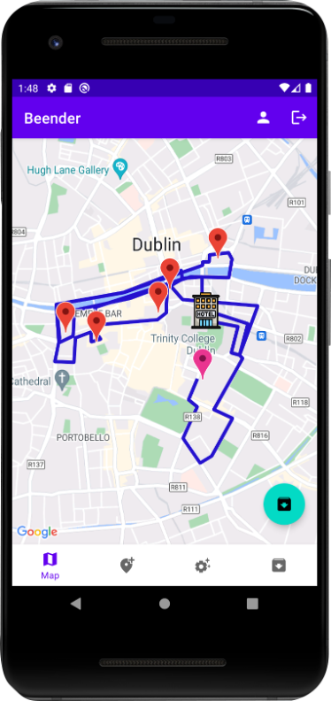
  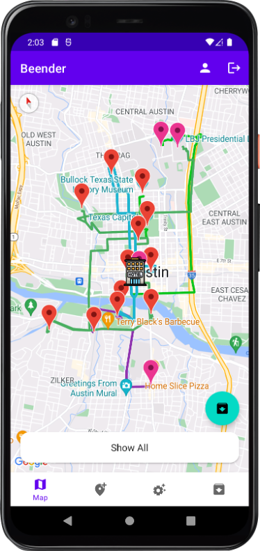

### Marker Options

When clicking on a marker in the Map screen, you are presented with a few options.

Remove marker: will remove that place from your trip, and recalculate the route again.

  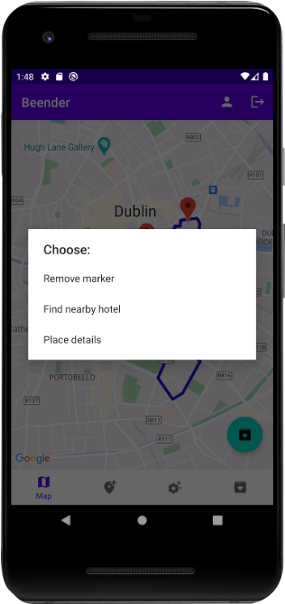
  
Find nearby hotel: will search for hotels near that marker. You will be directed to another card-swiping screen, where you can choose a hotel that you’d like.
After swiping right on a hotel, it will be added to your trip, and the route will be recalculated again.

Place details: will direct you to the Details screen of that place. After reading about the place you can press the back button to go back.

### Archive screen

  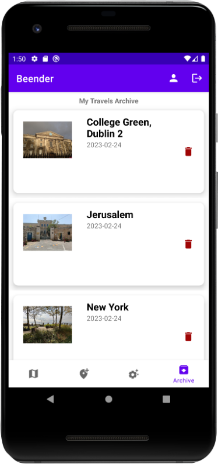
  

  The archive screen contains all trips you’ve archived. Each card shows you a thumbnail, title of the starting place, and the date which you archived the trip.
  
  Clicking the delete icon will remove the archived trip from the database.
  Clicking on the image thumbnail will load the archive to the Map screen.
  
  After loading an archive to the map, you can make any edits as you like, such as removing markers, or adding hotels near markers. After finishing with the edits, you can click on the round green Save button on the bottom of the screen which will save all your edits.
  
  The archives are saved in our cloud database. Meaning that you can view them from any device you want, as long as you login to your account where you saved those archives.

### App User Flowchart

This diagram shows the basic flowchart of the app. The arrow show which screen directly connects to another screen.

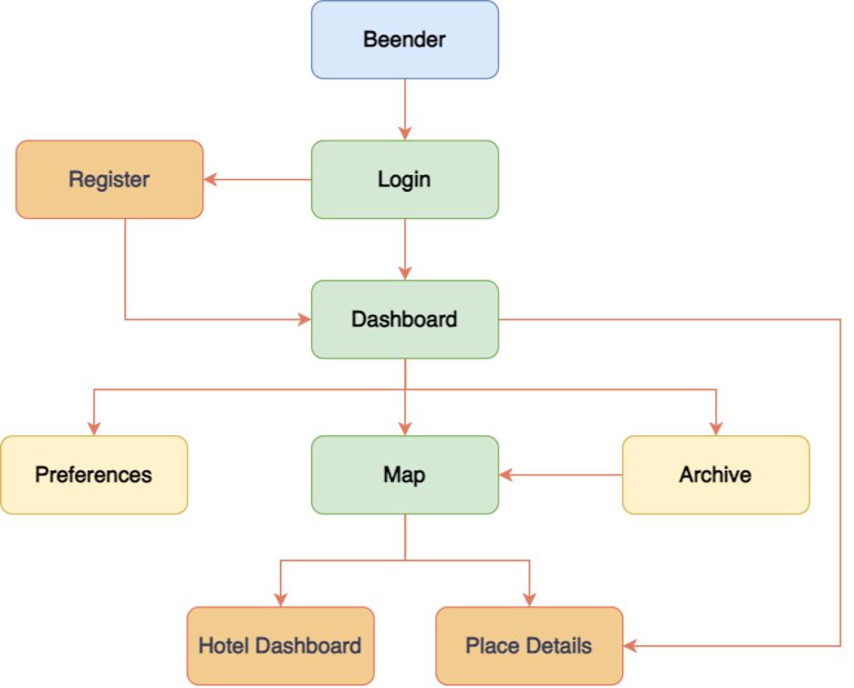
